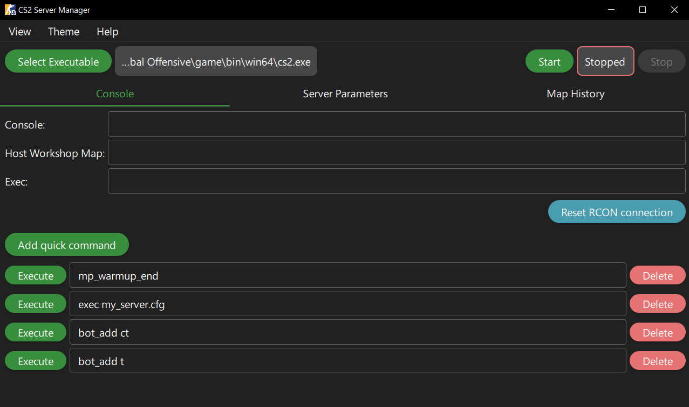
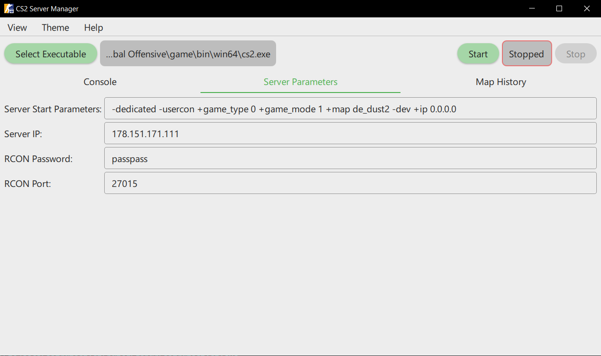
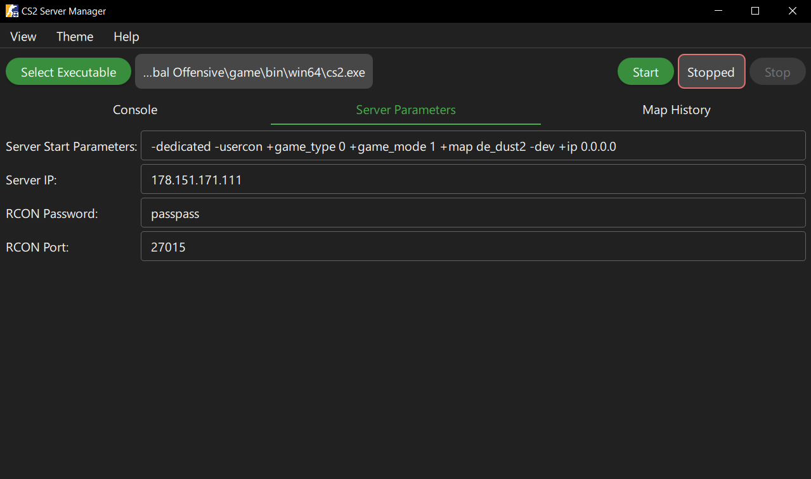
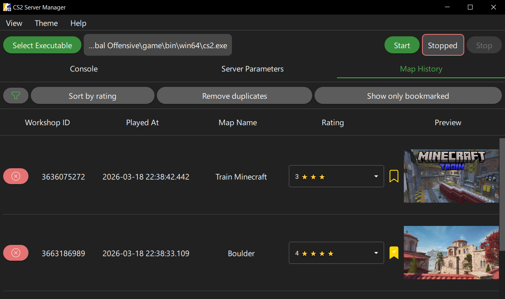
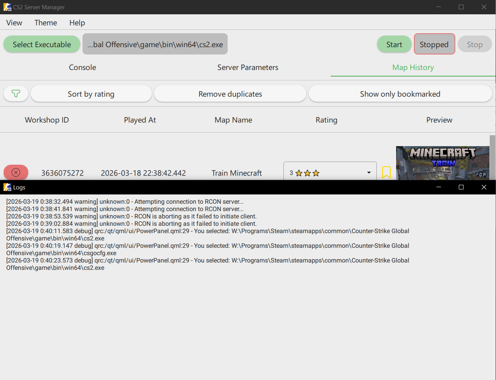

# CS2 Server Manager

   

This is a very simple app I've created for managing my local server to play with friends because typing commands into server cmd was not really convenient. The app is mostly intended to be used with local server on the same machine, but you also can connect to a remote server via RCON (Stopping and starting will not work).

Written in C++ and QML as an exercise.

## UI

    

## Features

✅ Start and stop local server

✅ Config file in the working directory

✅ No installer, everything works inside app directory

✅ RCON Console and some additional helpful inputs

✅ History of the entered commands

✅ Scaling on different resolutions, users also change the scale from app settings

✅ Light and dark themes

✅ History of the downloaded maps

⬜️ Redirect server cmd output into a panel inside the application and get rid of standalone window if possible

## Build

### Prerequisits

The project uses Conan 2, so make sure the Conan is installed and is invokable, e.g.:
```
$ pip install conan

$ conan --version
Conan version 2.24.0
```

If build fails with conan profile related issue, try:
```
conan profile detect --force
```

Versions of dependencies used, probably will work on newer versions as well:

- QtCreator 13.0.0 (Windows)
- Qt 6.10.2
- [rconpp](https://github.com/Jaskowicz1/rconpp) at [d77993b](https://github.com/Jaskowicz1/rconpp/commit/d77993b1e8993701dbf6b2974b41045a915c7b42)
- Conan 2 and dependencies retrieved using it, see conanfile.txt for more details
- CMake 4.0.0

### Build Process Windows

Open the project in Qt Creator and hit build.

### Build Process Linux

For building on linux I am using static build of QT to ease the deployment process. Quick info on how to build QT for static linking, for more up to date commands see the Dockerfile:
1. Check out QT repo in any directory of your choosing:
    ```
    git clone --branch v6.10.2 https://code.qt.io/qt/qt5.git qt
    cd qt
    ./init-repository -submodules qtwayland,qtdeclarative,qtbase,qtsvg
    ```
2. Configure:
    ```
    mkdir -p /qtroot/install
    mkdir -p /qtroot/build
    cd /qtroot/build
    ../qt/configure -submodules qtwayland,qtdeclarative,qtbase,qtsvg -skip qtimageformats -static -feature-freetype -fontconfig -prefix /qtroot/install
    ```
3. Build:
    ```
    cd /qtroot/build
    cmake --build . --parallel
    cmake --install .
    ```

After that create `.env` file in the project root directory to set `Qt6_ROOT` CMake variable, example of file contents (the variable can also be passed for the following build step to CMake, but it's more convenient to use a file):
```
Qt6_ROOT=/mnt/btrwdblack/Programs/Qt/Sources/install
```

For building the application you can use these commands:

```bash
cmake --preset release
cmake --build --preset release
```

## Deploy

### Windows

In order to deploy the built binary you need to have `windeployqt.exe` reachable from the `powershell` (easiest way is to set `QTDIR` environment variable on your system).

There are a few scripts, one to move the binary and all required dependencies:
```powershell
# From project root directory.
.\scripts\deploy_win.ps1 .\build\Release-Desktop_Qt_6_7_0_MSVC2019_64bit_MSVC2022 .\deploy\cs2guiserver
```

And the second is to package the new directory into an archive:
```powershell
.\scripts\package_win.ps1 .\deploy\cs2guiserver
```

For convenience there is also a combined script:
```powershell
.\scripts\deploy_and_package_win.ps1 .\build\Release-Desktop_Qt_6_7_0_MSVC2019_64bit_MSVC2022 .\deploy\cs2guiserver
```

### Linux

I use Docker to build the app on an older system (Ubuntu 24 for now) in order for it to link to library versions that are present on other systems so it's not usable only on arch.
```
docker build -t app-builder .
docker run --rm -v $(pwd):/build -v $(pwd)/install:/install app-builder
```

After that you can just copy the binary from `install/bin` folder and distribute it.

Note: `build` and `install` folder may be created by the docker container so in order to delete them you probably need `sudo`, hopefully I will fix it in the future.

### Supported Platforms

Windows: Tested on Windows 10 22H2 (19045.4412), but in theory should work on any version of Win10 and above.

Linux: Can be built and used on Linux as well, tested on EndeavourOS (6.18.7-arch1-1), but there shouldn't be problems building it on other or older systems.
