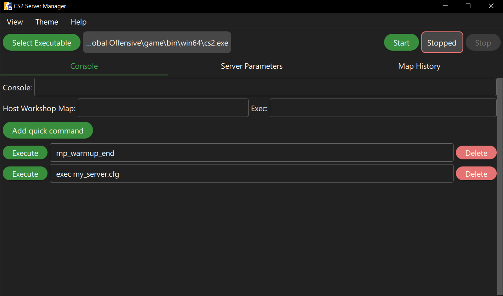
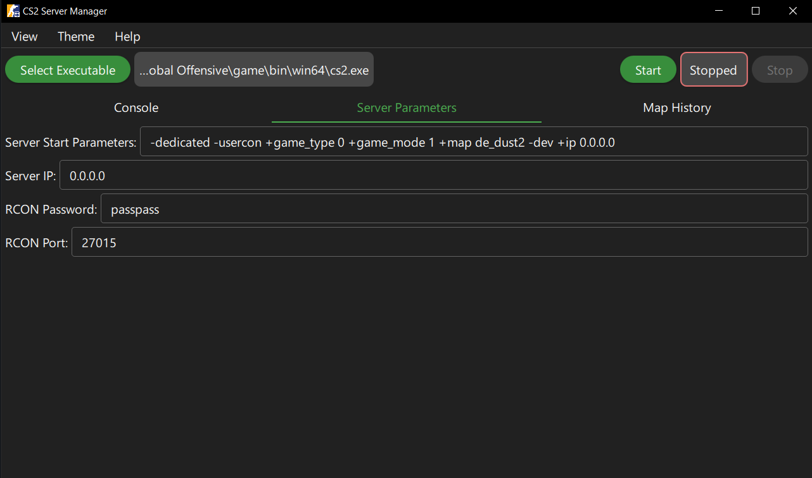

# CS2 Server Manager

 

This is a very simple app I created for managing my local server to play with friends because typing commands into server cmd was not really convenient. The app is mostly intended to be used with local server on the same machine, but you also can connect to a remote server via RCON (Stopping and starting will not work).

Written in C++ and QML as an exercise.

## Interface

 

## Features

✅ Start and stop local server

✅ Config file in the working directory

✅ No installer, everything works inside app directory

✅ RCON Console and some additional helpful inputs

⬜️ Good looking design

⬜️ Redirect server cmd output into a panel inside the application and get rid of standalone window if possible

## Build

Open the project in Qt Creator and hit build.

Versions of dependencies used:

- QtCreator 13.0.0
- Qt 6.6.0 (MSVC 2019)
- [rconpp](https://github.com/Jaskowicz1/rconpp) at [d77993b](https://github.com/Jaskowicz1/rconpp/commit/d77993b1e8993701dbf6b2974b41045a915c7b42)
- CMake 3.29.2

### Supported Platforms

For now it only works on `Windows`. Maybe there will be Linux support in the future. Tested on Windows 10 22H2 (19045.4412), but in theory should work on any version of win10 and above.
