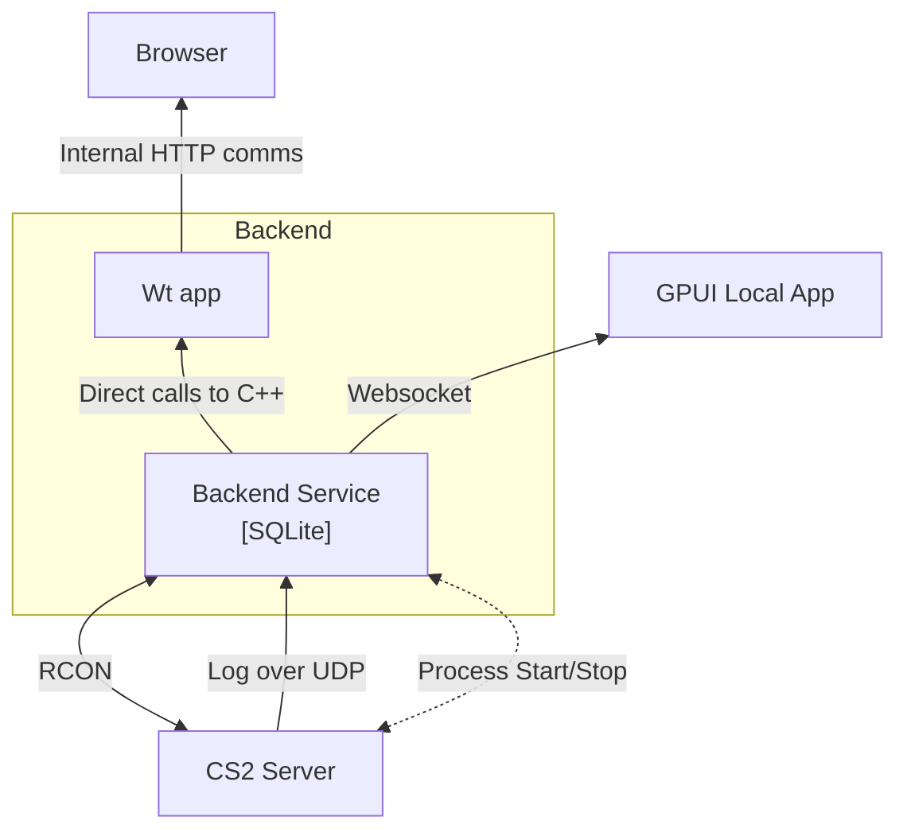

# Architecture

The new architecture for refactoring is planned like the following:

```mermaid
flowchart BT
    server["CS2 Server"]
    backend["Backend Service\n[SQLite]"]
    localUI["GPUI Local App"]
    webUI["Wt app"]
    browser["Browser"]

    server<-->|RCON|backend
    server-->|Log over UDP|backend
    backend<-.->|Process Start/Stop|server

    subgraph "Backend"
        backend-->|Direct calls to C++|webUI
    end

    backend-->|Websocket|localUI
    webUI-->|Internal HTTP comms|browser
```
